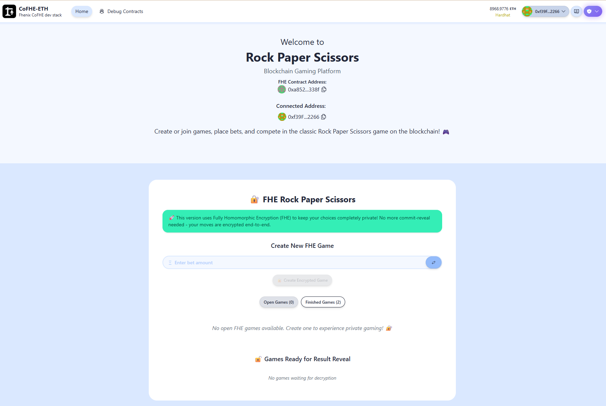

# 🔐 FHE Rock Paper Scissors

A fully homomorphic encryption (FHE) implementation of Rock Paper Scissors using CoFHE and Scaffold-ETH 2.

## Overview

This project demonstrates how to build a privacy-preserving Rock Paper Scissors game using Fully Homomorphic Encryption (FHE) on the Fhenix blockchain. Players' choices remain encrypted throughout the game, ensuring complete privacy.

### Key Features

- 🔐 **End-to-End Encryption**: Player choices are encrypted using FHE
- 🎮 **Real-Time Gameplay**: Interactive UI for creating and joining games
- 💰 **ETH Betting**: Support for betting with ETH
- 🔍 **Transparent Results**: Clear display of game outcomes while maintaining privacy
- 🛠 **Built with CoFHE**: Leverages Fhenix's CoFHE for on-chain FHE computation

## Screenshots



## Technical Stack

- **Smart Contracts**: Solidity 0.8.25 with CoFHE
- **Frontend**: Next.js, React, TailwindCSS
- **Blockchain**: Fhenix (Sepolia & Arbitrum Sepolia)
- **Development**: Hardhat, TypeScript
- **Web3**: Wagmi, Viem

## Getting Started

### Prerequisites

- Node.js (>= v20.18.3)
- Yarn
- Git

### Installation

1. Clone the repository:
```bash
git clone https://github.com/FhenixProtocol/rps-cofhe-scaffold-example.git
cd rps-cofhe-scaffold-example
```

2. Install dependencies:
```bash
yarn install
```

3. Start a local network:
```bash
yarn chain
```

4. Deploy the contract:
```bash
yarn deploy
```

5. Start the frontend:
```bash
yarn start
```

Visit `http://localhost:3000` to start playing!

## How It Works

1. **Game Creation**: Players can create a new game by specifying a bet amount
2. **Joining Games**: Other players can join existing games by matching the bet amount
3. **Making Moves**: Players submit their choices (Rock, Paper, or Scissors) which are encrypted using FHE
4. **Revealing Results**: Once both players have submitted their moves, the game creator can reveal the winner
5. **Prize Distribution**: Winners receive the prize pool (2x bet amount)

## Development

- Smart contracts are in `packages/hardhat/contracts`
- Frontend components are in `packages/nextjs/app`
- Tests are in `packages/hardhat/test`


## License

This project is licensed under the MIT License - see the LICENSE file for details.

## Acknowledgments

- [Scaffold-ETH 2](https://github.com/scaffold-eth/scaffold-eth-2)
- [CoFHE](https://cofhe-docs.fhenix.zone)
- [Fhenix](https://fhenix.io)
